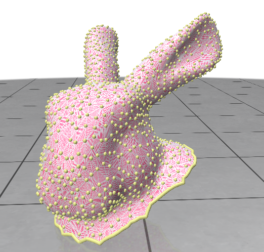

# Paramétrisation de Tutte

## Usage

Ce dépôt contient une ébauche d'une implémentation de la paramétrisation de Tutte, avec comme document de référence [Least Squares Conformal Maps](https://members.loria.fr/Bruno.Levy/papers/LSCM_SIGGRAPH_2002.pdf) et [Paramétrisation de maillage](https://codimd.math.cnrs.fr/s/GGhM7E8DX#), un cours de Jacques-Olivier Lachaud.

Pour installer les dépendances, vous pouvez télécharger avec Pip `polyscope` et `numpy`, ou utiliser `pipenv install`.

## Le code

La répartition du code est la suivante : 
* `wavefront.py` : permet de charger les faces et vertexes d'un objet wavefront (.obj)
* `param_tutte.py` : contient les ébauches de la paramétrisation de Tutte
* `main.py` : contient le code permettant l'affichage avec polyscope

En l'état, nous pouvons récuperer les vertexes du bord de la figure. On construit ensuite un Laplacien de la figure.
Nous n'avons pas reussi a fixer les bords.

### param_tutte.py

Dans un premier temps, on construit un dictionnaire des voisins de chaques vertexes. (*compute_neighors*)

Ensuite, on construit un Laplacien : (*make_laplacian*)
* Dans la diagonal (la relation d'un vertexe avec lui même), nous retrouvons l'opposé du nombre de voisins
* Dans le reste de la ligne, nous mettons un 1 à chaque fois qu'il est en relation avec un voisin, et 0 sinon.

Comme dit précédemment, nous n'avons pas réussi à fixer les bords.

Le but était de se retrouver avec une équation `LU = b`, où `L` est le Laplacien, `U` la matrice recherchée (dont nous connaissons certaines valeurs choisi pour fixer le bord), et `b` le vecteur que nous devions définir pour fixer les bords.

## Screenshots

*Tête de lapin avec les vetrexes du bord en sur brillance*

==Fixer le sommet bord $j$ à $x_j$==
$\begin{bmatrix} \ddots & \ddots & \ddots & \vdots & \ddots \\ \ddots & \ddots & \ddots & 1 & \ddots \\ \ddots & \ddots & \ddots & \vdots & \ddots \\ \cdots & 1 & \cdots & -4 & \cdots \\ \ddots & \ddots & \ddots & \vdots & \ddots \\\end{bmatrix}\mathbf{U}=\begin{bmatrix}\vdots \\ \vdots \\ \vdots \\ \vdots \\ \vdots \end{bmatrix}$ devient $\begin{bmatrix} \ddots & \ddots & \ddots & \vdots & \ddots \\ \ddots & \ddots & \ddots & 0 & \ddots \\ \ddots & \ddots & \ddots & \vdots & \ddots \\ \cdots & 0 & \cdots & 1 & \cdots \\ \ddots & \ddots & \ddots & \vdots & \ddots \\\end{bmatrix}\mathbf{U}=\begin{bmatrix}\vdots \\ \cdots -x_j \\ \vdots \\ x_j \\ \vdots \end{bmatrix}$ 